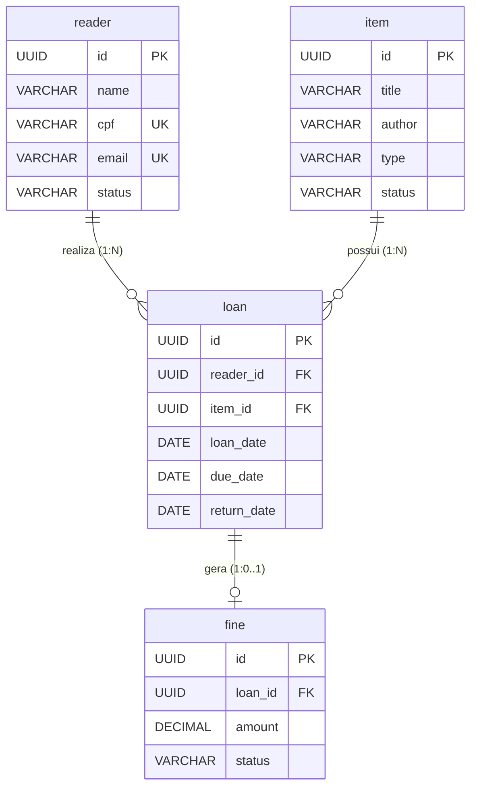

# Documentação do Banco de Dados: Biblioteca Municipal

## 1. Data Dictionary (Dicionário de Dados)

### Tabela: `reader`
Armazena as informações dos leitores cadastrados na biblioteca.

| Column Name | Data Type & Constraints | Keys | Description |
| :--- | :--- | :--- | :--- |
| `id` | `UUID`, `DEFAULT gen_random_uuid()`, `NOT NULL` | PK | Identificador único do leitor no sistema. |
| `name` | `VARCHAR(100)`, `NOT NULL` | - | Nome completo do leitor. |
| `cpf` | `VARCHAR(14)`, `UNIQUE`, `NOT NULL` | UK | Documento de identificação exigido para validação de unicidade e controle de inadimplência. |
| `email` | `VARCHAR(100)`, `UNIQUE`, `NOT NULL` | UK | E-mail principal de contato e acesso ao portal web. |
| `status` | `VARCHAR(20)`, `DEFAULT 'ACTIVE'`, `CHECK` | - | Estado atual do leitor (`ACTIVE` ou `SUSPENDED`). Determina se o usuário está apto a realizar novos empréstimos. |

### Tabela: `item`
Representa o acervo físico. Cada registro é um exemplar único.

| Column Name | Data Type & Constraints | Keys | Description |
| :--- | :--- | :--- | :--- |
| `id` | `UUID`, `DEFAULT gen_random_uuid()`, `NOT NULL` | PK | Identificador físico e único de uma obra. |
| `title` | `VARCHAR(200)`, `NOT NULL` | - | Título da obra. |
| `author` | `VARCHAR(100)`, `NOT NULL` | - | Autor ou criador da obra. |
| `type` | `VARCHAR(20)`, `NOT NULL`, `CHECK` | - | Categoria do material (`BOOK`, `MAGAZINE`, `MEDIA`). |
| `status` | `VARCHAR(20)`, `DEFAULT 'AVAILABLE'`, `CHECK`| - | Controle de disponibilidade do exemplar (`AVAILABLE`, `BORROWED`, `MAINTENANCE`). |

### Tabela: `loan`
Registra o histórico de transações de retirada e devolução de obras.

| Column Name | Data Type & Constraints | Keys | Description |
| :--- | :--- | :--- | :--- |
| `id` | `UUID`, `DEFAULT gen_random_uuid()`, `NOT NULL` | PK | Identificador único da transação de empréstimo. |
| `reader_id` | `UUID`, `NOT NULL` | FK | Referência ao leitor que realizou a retirada. |
| `item_id` | `UUID`, `NOT NULL` | FK | Referência à obra física emprestada. |
| `loan_date` | `DATE`, `DEFAULT CURRENT_DATE`, `NOT NULL`| - | Data em que o exemplar foi entregue fisicamente no balcão. |
| `due_date` | `DATE`, `NOT NULL` | - | Data limite estipulada para a devolução sem incidência de multa. Nota: O cálculo do prazo de empréstimo (ex: 14 dias) é de responsabilidade exclusiva da aplicação backend (Spring Boot), que deve definir e enviar a data final mapeada no momento da requisição de INSERT. |
| `return_date`| `DATE`, `NULL` | - | Data real de devolução. Quando nulo, sinaliza que o empréstimo está em curso. |

### Tabela: `fine`
Controla as penalidades financeiras geradas por devoluções fora do prazo estipulado.

| Column Name | Data Type & Constraints | Keys | Description |
| :--- | :--- | :--- | :--- |
| `id` | `UUID`, `DEFAULT gen_random_uuid()`, `NOT NULL` | PK | Identificador único da cobrança gerada. |
| `loan_id` | `UUID`, `UNIQUE`, `NOT NULL` | FK | Referência ao empréstimo que originou o atraso. Relação 1:1, garantindo que um empréstimo gere no máximo uma multa. |
| `amount` | `DECIMAL(10,2)`, `NOT NULL` | - | Valor financeiro total da multa, calculado via *procedure*. |
| `status` | `VARCHAR(20)`, `DEFAULT 'PENDING'`, `CHECK` | - | Situação de quitação (`PENDING` ou `PAID`). Multas pendentes mantêm o leitor bloqueado. |

---

## 2. Entity-Relationship Diagram (ERD)


## 3. Business Rules & Constraints (Regras de Negócio e Contexto)

Esta arquitetura delega a execução de regras críticas de negócio diretamente ao SGBD para garantir integridade e consistência em operações concorrentes.

### 3.1. Restrições de Exclusão e Retenção de Dados
* **Proibição de Exclusão (ON DELETE RESTRICT):** Não existem *Soft Deletes* (marcação de `is_active = false`) para leitores e itens nesta versão. No entanto, exclusões físicas (*Hard Deletes*) em `reader` ou `item` são rigidamente bloqueadas pela restrição `ON DELETE RESTRICT` nas tabelas `loan` e `fine`. É impossível excluir um leitor ou obra que possua qualquer histórico no sistema.

### 3.2. Controle de Concorrência
* **Row-Level Lock (FOR UPDATE):** Durante o registro de um novo empréstimo, a consulta de disponibilidade do item realiza um travamento de linha (`SELECT ... FOR UPDATE`). Isso previne *Race Conditions*, garantindo que duas requisições simultâneas não consigam emprestar o mesmo exemplar físico de uma só vez.

### 3.3. Lógicas Internas (Triggers e Procedures)
A API atuará apenas como repassadora nas operações de CRUD; a inteligência e os bloqueios residem nas seguintes regras do banco:

* **`trg_check_loan_validity` (Executada `BEFORE INSERT` em `loan`):**
  1. Verifica se o `reader` não está com status `SUSPENDED`.
  2. Verifica se o `reader` atingiu o limite de **3 empréstimos ativos** simultaneamente (onde `return_date IS NULL`).
  3. Garante que o `item` está com status `AVAILABLE`.
  4. Se todas as checagens passarem, atualiza automaticamente o status do `item` para `BORROWED` e conclui o empréstimo.

* **`trg_process_item_return` (Executada `BEFORE UPDATE` em `loan`):**
  1. Dispara apenas quando a `return_date` recebe um valor.
  2. Devolve o `item` ao acervo alterando seu status de volta para `AVAILABLE`.
  3. Se a return_date for superior à due_date, calcula os dias de atraso e os multiplica pela taxa fixa de R$ 2,00 por dia, inserindo automaticamente um registro correspondente na tabela fine com o valor total devido.
* **`trg_block_reader_on_fine` (Executada `AFTER INSERT` em `fine`):**
  1. Após o processamento de uma devolução com atraso (que originou a multa), captura o ID do leitor vinculado ao empréstimo e altera imediatamente o seu status em `reader` para `SUSPENDED`, efetivando o bloqueio automático de inadimplência exigido pelo sistema.


### 4 Modelo de Banco de Dados

Abaixo está a especificação técnica do banco de dados, incluindo a criação das tabelas (DDL) e as regras de negócio implementadas diretamente via procedures e triggers no PostgreSQL.

### 4.1. Criação das Tabelas (DDL)

As tabelas utilizam identificadores universais (`UUID`) gerados nativamente para garantir unicidade e consistência entre os registros de leitores, itens do acervo, empréstimos e multas.


```sql
CREATE TABLE reader (
    id UUID PRIMARY KEY DEFAULT gen_random_uuid(),
    name VARCHAR(100) NOT NULL,
    cpf VARCHAR(14) UNIQUE NOT NULL,
    email VARCHAR(100) UNIQUE NOT NULL,
    status VARCHAR(20) DEFAULT 'ACTIVE' CHECK (status IN ('ACTIVE', 'SUSPENDED'))
);

CREATE TABLE item (
    id UUID PRIMARY KEY DEFAULT gen_random_uuid(),
    title VARCHAR(200) NOT NULL,
    author VARCHAR(100) NOT NULL,
    type VARCHAR(20) NOT NULL CHECK (type IN ('BOOK', 'MAGAZINE', 'MEDIA')),
    status VARCHAR(20) DEFAULT 'AVAILABLE' CHECK (status IN ('AVAILABLE', 'BORROWED', 'MAINTENANCE'))
);

CREATE TABLE loan (
    id UUID PRIMARY KEY DEFAULT gen_random_uuid(),
    reader_id UUID NOT NULL REFERENCES reader(id) ON DELETE RESTRICT,
    item_id UUID NOT NULL REFERENCES item(id) ON DELETE RESTRICT,
    loan_date DATE NOT NULL DEFAULT CURRENT_DATE,
    due_date DATE NOT NULL,
    return_date DATE
);

CREATE TABLE fine (
    id UUID PRIMARY KEY DEFAULT gen_random_uuid(),
    loan_id UUID UNIQUE NOT NULL REFERENCES loan(id) ON DELETE RESTRICT,
    amount DECIMAL(10,2) NOT NULL,
    status VARCHAR(20) DEFAULT 'PENDING' CHECK (status IN ('PENDING', 'PAID'))
);
```

### 4.2. Regras de Negócio Nativas (Procedures e Triggers)

```sql
-- -----------------------------------------------------------------------------------
-- Função: Validações antes de registrar um empréstimo (RN01, RN02, RN03)
-- -----------------------------------------------------------------------------------

CREATE OR REPLACE FUNCTION check_loan_validity()
RETURNS TRIGGER AS $$
DECLARE
    v_reader_status VARCHAR;
    v_active_loans INT;
    v_item_status VARCHAR;
BEGIN
    -- RN03: Verifica se o Leitor está suspenso
    SELECT status INTO v_reader_status FROM reader WHERE id = NEW.reader_id;
    IF v_reader_status = 'SUSPENDED' THEN
        RAISE EXCEPTION 'Loan rejected: Reader % is suspended.', NEW.reader_id;
    END IF;

    -- RN02: Verifica se o Leitor já atingiu o limite de 3 empréstimos ativos
    SELECT COUNT(*) INTO v_active_loans FROM loan WHERE reader_id = NEW.reader_id AND return_date IS NULL;
    IF v_active_loans >= 3 THEN
        RAISE EXCEPTION 'Loan rejected: Reader % has reached the limit of 3 active loans.', NEW.reader_id;
    END IF;

    -- RN01: Verifica se a obra está disponível (Utilizando trava de linha FOR UPDATE para concorrência)
    SELECT status INTO v_item_status FROM item WHERE id = NEW.item_id FOR UPDATE;
    IF v_item_status != 'AVAILABLE' THEN
        RAISE EXCEPTION 'Loan rejected: Item % is not available (Current status: %).', NEW.item_id, v_item_status;
    END IF;

    -- Tudo certo: Altera o status físico do item para emprestado
    UPDATE item SET status = 'BORROWED' WHERE id = NEW.item_id;

    RETURN NEW;
END;
$$ LANGUAGE plpgsql;

CREATE TRIGGER trg_check_loan_validity
BEFORE INSERT ON loan
FOR EACH ROW EXECUTE FUNCTION check_loan_validity();


-- -----------------------------------------------------------------------------------
-- Função: Executada na devolução do item (RN04, UC08)
-- -----------------------------------------------------------------------------------
CREATE OR REPLACE FUNCTION process_item_return()
RETURNS TRIGGER AS $$
DECLARE
    v_overdue_days INT;
    v_fine_rate DECIMAL(10,2) := 2.00; -- Taxa diária fixa para atraso
    v_fine_amount DECIMAL(10,2);
BEGIN
    -- Intercepta apenas o evento de devolução (quando o return_date é preenchido)
    IF NEW.return_date IS NOT NULL AND OLD.return_date IS NULL THEN
        
        -- Devolve a obra fisicamente ao acervo
        UPDATE item SET status = 'AVAILABLE' WHERE id = NEW.item_id;

        -- RN04: Valida se houve atraso e processa a multa
        IF NEW.return_date > NEW.due_date THEN
            v_overdue_days := NEW.return_date - NEW.due_date;
            v_fine_amount := v_overdue_days * v_fine_rate;

            -- Insere o registro de multa associado a este empréstimo
            INSERT INTO fine (loan_id, amount, status)
            VALUES (NEW.id, v_fine_amount, 'PENDING');
        END IF;
    END IF;

    RETURN NEW;
END;
$$ LANGUAGE plpgsql;

CREATE TRIGGER trg_process_item_return
BEFORE UPDATE ON loan
FOR EACH ROW EXECUTE FUNCTION process_item_return();


-- -----------------------------------------------------------------------------------
-- Função: Bloqueio automático do leitor (UC09)
-- -----------------------------------------------------------------------------------
CREATE OR REPLACE FUNCTION block_reader_on_fine()
RETURNS TRIGGER AS $$
DECLARE
    v_reader_id UUID;
BEGIN
    -- Recupera o ID do leitor a partir da tabela de empréstimos
    SELECT reader_id INTO v_reader_id FROM loan WHERE id = NEW.loan_id;
    
    -- Altera o status do leitor para SUSPENSO
    UPDATE reader SET status = 'SUSPENDED' WHERE id = v_reader_id;

    RETURN NEW;
END;
$$ LANGUAGE plpgsql;

CREATE TRIGGER trg_block_reader_on_fine
AFTER INSERT ON fine
FOR EACH ROW EXECUTE FUNCTION block_reader_on_fine();
```