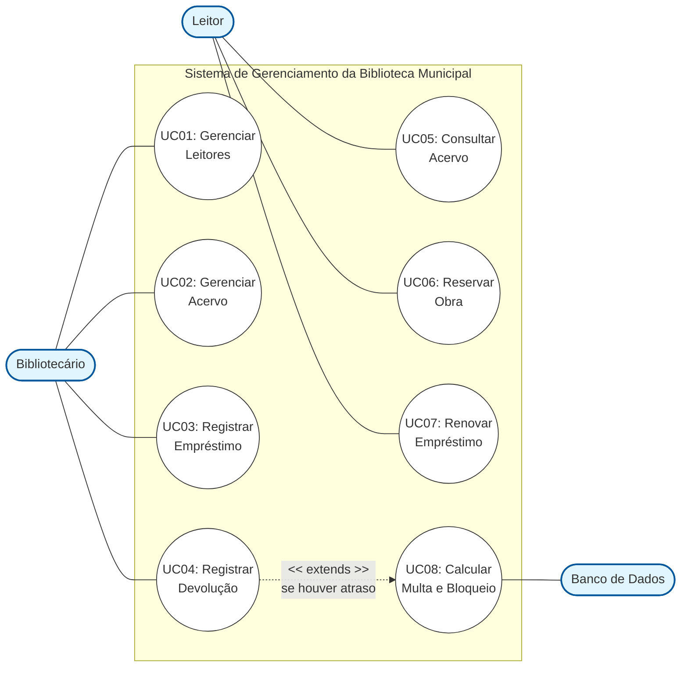
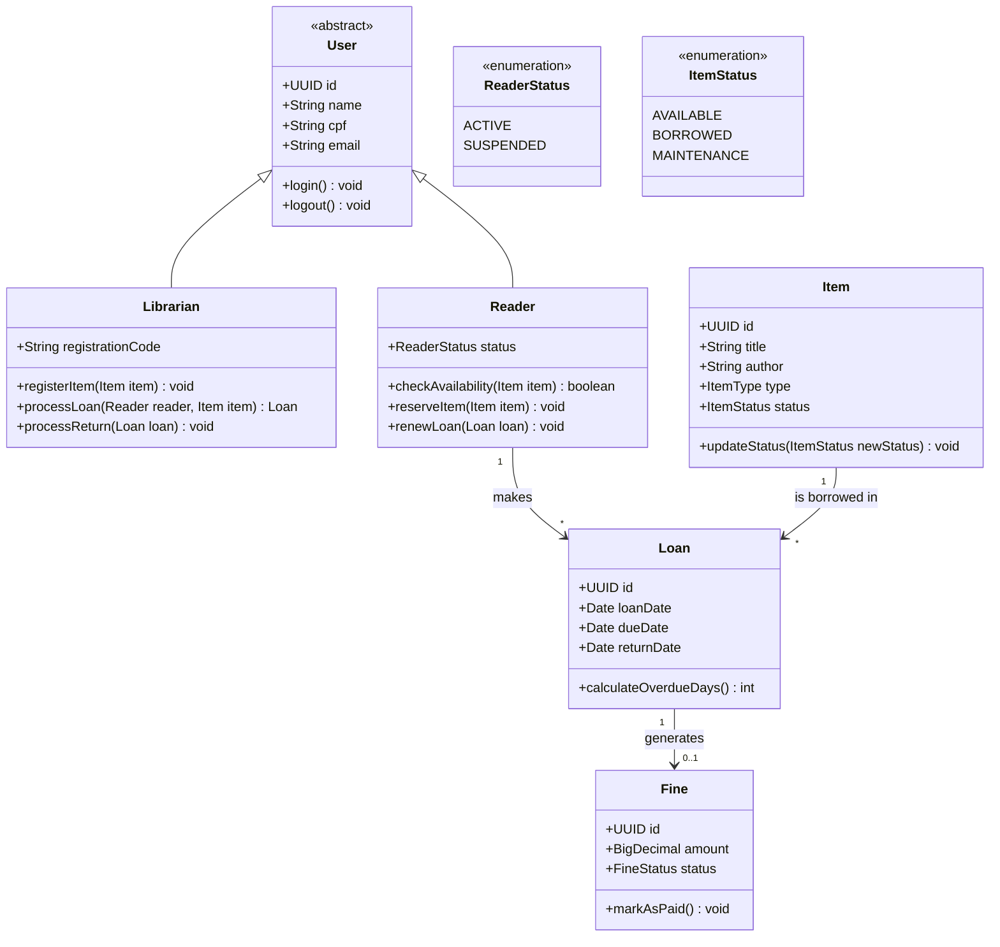
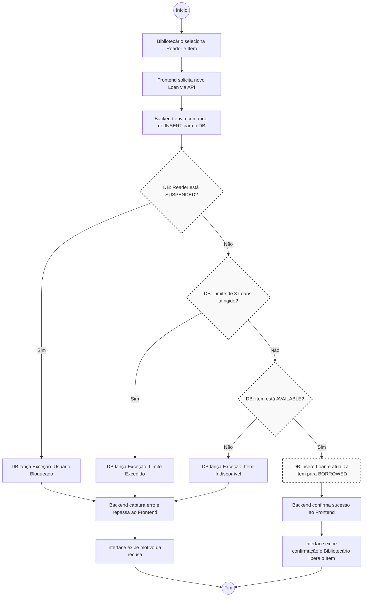
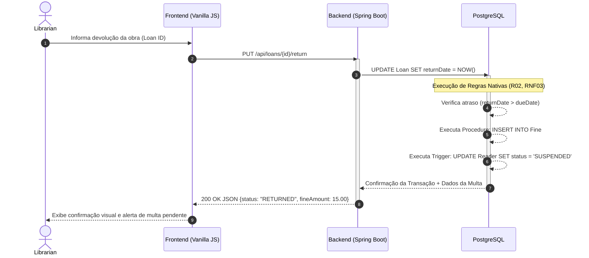
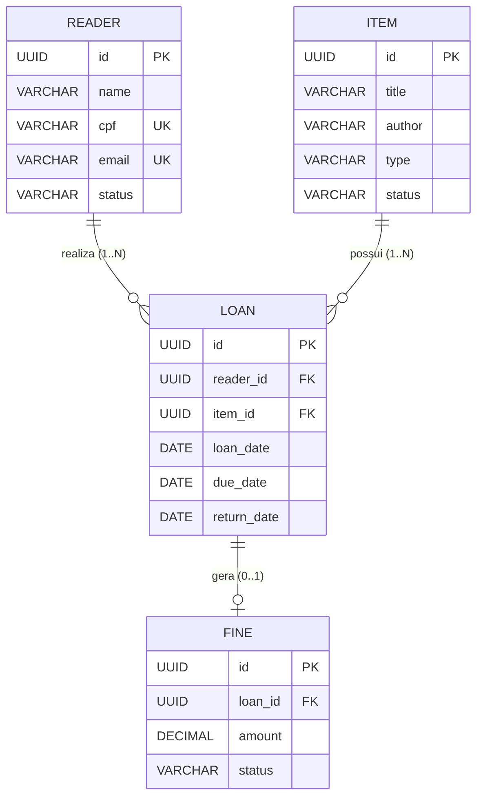

# Documentação do Sistema: Biblioteca Digital

# 1. Introdução

## 1.1. Propósito
Este documento especifica os requisitos do sistema de gerenciamento de biblioteca a ser desenvolvido para a <Nome da Biblioteca Municipal>, fornecendo as informações necessárias para a implementação, testes e homologação do sistema.

## 1.2. Público-Alvo
Este documento destina-se à equipe de desenvolvimento (desenvolvedores e testadores) e aos responsáveis pela homologação do sistema.

## 1.3. Escopo
O sistema consistirá em uma plataforma web para modernizar o controle interno da biblioteca, substituindo o uso atual de planilhas. O escopo limita-se a:
* **Módulo Administrativo (Bibliotecários):** CRUD de acervo (livros, revistas e mídias), gerenciamento de cadastro de leitores, registro de empréstimos, devoluções e aplicação de regras de bloqueio/multa por atraso.
* **Portal do Leitor (Web):** Consulta de disponibilidade do acervo, reserva de obras e renovação de empréstimos vigentes.

## 1.4. Definições e Abreviações
* **CRUD:** *Create, Read, Update, Delete* (Operações básicas de cadastro).
* **RF:** Requisito Funcional.
* **RNF:** Requisito Não Funcional.

## 1.5. Referências
* Lei Geral de Proteção de Dados (LGPD) — Aplicada ao armazenamento dos dados cadastrais dos leitores.

## 1.6. Visão Geral do Documento
Este documento está dividido nas seguintes seções:
* **Seção 2:** Premissas e restrições do sistema.
* **Seção 3:** Requisitos Funcionais (RF).
* **Seção 4:** Requisitos Não Funcionais (RNF).

# 2. Visão Geral
O projeto busca estruturar um sistema para controle do acervo, leitores e empréstimos de uma biblioteca municipal, substituindo o controle atual por planilhas. A arquitetura consiste em um backend em Java (Spring Boot) para gerenciar a interface web, persistência de dados e requisições, delegando regras específicas de validação (cálculo de multas e impedimentos) ao banco de dados relacional por meio de scripts estruturados, conforme as restrições do projeto.

---

# 3. Atores do Sistema
* **Bibliotecário:** Operador do sistema no balcão da biblioteca. Possui permissões totais para gerenciar o acervo, leitores, registrar empréstimos, devoluções e suspensões.
* **Leitor:** Usuário geral da biblioteca municipal que acessa o portal web para consultar o acervo, verificar sua situação, realizar reservas e renovações.
* **Banco de Dados (Sistema):** Mecanismo relacional que executa de forma nativa as validações de restrição de empréstimos, cálculos de multas e gatilhos de bloqueio.

---

# 4. Premissas e Restrições

### Premissas
* **P01:** As operações físicas de entrega e recebimento de obras são validadas e registradas pelo Bibliotecário no balcão.
* **P02:** O Leitor realiza operações de consulta, reserva e renovação de forma autônoma via Portal Web.
* **P03:** O inventário físico do acervo (livros, revistas e mídias) corresponde aos registros inseridos no banco de dados.

### Restrições
* **R01:** Toda a modelagem visual do sistema (diagramas) deve ser gerada estritamente em formato de texto estruturado usando PlantUML.
* **R02:** As regras de cálculo de multa por atraso e o bloqueio automático de novos empréstimos devem ser implementados na camada de banco de dados.
* **R03:** O sistema não permite a exclusão física (*Hard Delete*) de registros que possuam histórico de movimentação vinculado.

---

# 5. Arquitetura e Stack Tecnológica

O sistema foi concebido sob uma arquitetura monolítica simplificada, ideal para o escopo de um CRUD completo e direto, garantindo baixo custo operacional, facilidade de implantação no ambiente Debian/Linux e previsibilidade física dos dados.

---

## 5.1. Componentes da Stack

| Camada | Tecnologia | Propósito no Projeto |
| :--- | :--- | :--- |
| **Backend** | Java / Spring Boot | Construção da API REST interna, gerenciamento de rotas, persistência (Spring Data JPA) e controle de sessões. |
| **Banco de Dados** | PostgreSQL | Armazenamento relacional dos dados e execução nativa das validações críticas através de scripts estruturados (`PL/pgSQL`). |
| **Frontend** | HTML5 / CSS3 / Vanilla JS | Rerendização da interface do Bibliotecário e do Portal do Leitor. O JavaScript puro consumirá a API via `Fetch API` sem dependência de frameworks. |

---

## 5.2. Justificativa Técnica e Acoplamento

* **Backend Enxuto:** O Spring Boot atuará como um intermediário previsível entre as requisições web e o banco de dados. A escolha do ecossistema Java garante tipagem forte e consistência no tratamento de exceções lançadas pelo SGBD.
* **Persistência Relacional:** O PostgreSQL foi escolhido devido ao seu suporte robusto a funções internas (`Stored Procedures` e `Triggers`). Como o projeto exige que as regras de penalidades fiquem no banco de dados, a engine do Postgres oferece a estabilidade necessária para processar essas rotas lógicas de forma atômica.
* **Frontend sem Sobrecarga (Zero Build):** O uso de HTML, CSS e JavaScript puros elimina a necessidade de ferramentas pesadas de build (como Node.js, Webpack ou Vite) na estação de trabalho. A interface comunica-se com o backend de forma assíncrona, mantendo o carregamento rápido e o código legível no VS Code.

---

## 5.3. Implicações de Segurança e Infraestrutura

* **Centralização de Lógica no SGBD:** Mover o cálculo de multas e bloqueios para *triggers* e *procedures* no PostgreSQL reduz o acoplamento da regra de negócio no código Java, mas gera dependência direta do SGBD (*vendor lock-in*). Para o escopo deste projeto, o risco é aceitável, pois o ambiente de banco é fixo.
* **Validação de Entrada:** O Spring Boot parametrizará as consultas nativamente via JPA, neutralizando riscos de *SQL Injection*. No frontend, o uso de JavaScript puro exige atenção na manipulação do DOM (utilizando `textContent` em vez de `innerHTML`) para mitigar vulnerabilidades básicas de *Cross-Site Scripting* (XSS) ao exibir dados cadastrados por leitores.

# 6. Requisitos do Sistema

### Requisitos Funcionais (RF)
| ID | Descrição |
| :--- | :--- |
| **RF01** | Permitir ao **Bibliotecário** gerenciar o cadastro de **Leitores**. |
| **RF02** | Permitir ao **Bibliotecário** gerenciar o acervo (Livros, Revistas e Mídias) e a quantidade de exemplares disponíveis. |
| **RF03** | Permitir ao **Bibliotecário** registrar o empréstimo de uma obra para um **Leitor** ativo. |
| **RF04** | Permitir ao **Bibliotecário** registrar a devolução de obras, atualizando a data real de entrega. |
| **RF05** | Permitir ao **Leitor** consultar a disponibilidade de obras do acervo via Portal Web. |
| **RF06** | Permitir ao **Leitor** solicitar a reserva de uma obra que não esteja disponível no momento. |
| **RF07** | Permitir ao **Leitor** solicitar a renovação de um empréstimo vigente, caso não haja reserva para a obra. |
| **RF08** | Garantir que o **Banco de Dados** calcule automaticamente os dias de atraso e o valor da multa na devolução. |
| **RF09** | Garantir que o **Banco de Dados** bloqueie a criação de novos empréstimos para leitores com pendências. |

### Requisitos Não Funcionais (RNF)
| ID | Descrição |
| :--- | :--- |
| **RNF01** | O backend da aplicação deve ser desenvolvido em Java com o framework Spring Boot. |
| **RNF02** | O portal do leitor e o módulo do bibliotecário devem ser integrados em uma interface Web. |
| **RNF03** | O cálculo de multas por atraso deve ser implementado via *Stored Procedure* no banco de dados. |
| **RNF04** | O impedimento de novos empréstimos por atraso ou limite excedido deve ser validado via *Trigger* ou restrição no banco de dados. |
| **RNF05** | Os diagramas técnicos devem ser escritos utilizando a sintaxe PlantUML. |

---

# 7. Regras de Negócio (RN)
* **RN01 (Disponibilidade do Acervo):** Uma obra (livro, revista ou mídia) só pode ser emprestada se houver pelo menos um exemplar com status 'Disponível'.
* **RN02 (Limite de Empréstimos Simultâneos):** Um **Leitor** não pode possuir mais do que o limite máximo de obras emprestadas simultaneamente (ex: no máximo 3 obras).
* **RN03 (Bloqueio por Atraso/Inadimplência):** O sistema deve impedir um novo empréstimo se o **Leitor** possuir qualquer obra com data de devolução expirada ou multas não quitadas.
* **RN04 (Cálculo de Multa):** Caso a data de devolução real seja posterior à data prevista, a *Procedure* do banco de dados aplicará uma taxa fixa por dia de atraso.
* **RN05 (Regra para Renovação):** O **Leitor** só pode renovar um empréstimo se a obra não estiver reservada por outro usuário e se o próprio leitor não estiver bloqueado.
* **RN06 (Retenção de Histórico):** É proibida a exclusão de registros de leitores ou obras que possuam vínculos com empréstimos passados ou presentes (garantido por restrições de integridade do banco).

---

# 8. Estudo de Caso

O estudo de caso a seguir descreve cenários práticos que o sistema deve suportar. Para alinhar a especificação técnica às práticas comuns de mercado e garantir a manutenibilidade do código, as entidades do modelo de dados, estados (status) e variáveis são representados em inglês (ex: `Reader`, `Loan`, `Book`, `Status: ACTIVE, OVERDUE`).

---

## 8.1. Cenário 1: Cadastro e Atualização do Acervo (CRUD)
**Objetivo:** Demonstrar a alimentação básica do sistema pelo operador.

1. O **Bibliotecário** acessa o módulo administrativo e realiza o cadastro de três novas obras adquiridas pela biblioteca municipal:
   * Um livro técnico (`ItemType: BOOK`).
   * Uma revista científica (`ItemType: MAGAZINE`).
   * Um documentário em DVD (`ItemType: MEDIA`).
2. O sistema armazena os registros com o status inicial `Status: AVAILABLE`. 
3. Caso um exemplar sofra danos físicos, o bibliotecário altera manualmente seu estado para `Status: MAINTENANCE`, impedindo temporariamente novas saídas.

---

## 8.2. Cenário 2: Fluxo Padrão de Empréstimo e Limite de Obras
**Objetivo:** Validar as restrições de quantidade simultânea por leitor.

1. O leitor João (`Reader`), que possui cadastro ativo (`Status: ACTIVE`), solicita o empréstimo de duas obras no balcão de atendimento.
2. O **Bibliotecário** registra a saída de ambas as obras. O sistema gera os registros na tabela `Loan`, define a data prevista de entrega para 14 dias à frente e atualiza o estado das obras para `Status: BORROWED`.
3. No dia seguinte, João tenta realizar o empréstimo de mais duas obras. 
4. Ao tentar salvar o quarto empréstimo, a restrição de banco de dados (regra baseada no limite de 3 obras simultâneas por pessoa) bloqueia a operação, retornando uma exceção de validação para a interface. O empréstimo é recusado.

---

## 8.3. Cenário 3: Devolução com Atraso, Multa e Bloqueio Automático
**Objetivo:** Demonstrar a execução da lógica de negócio na camada de banco de dados (*Procedures* e *Triggers*).

1. A leitora Maria possui um livro cujo prazo de devolução expirou há 5 dias. No banco de dados, a data prevista (`due_date`) é menor que a data atual, mas a data de entrega (`return_date`) permanece nula.
2. Maria acessa o Portal do Leitor para tentar renovar o livro ou reservar uma nova obra. A aplicação web bloqueia as opções de interação de Maria baseada na regra de atraso detectada.
3. Maria comparece ao balcão e entrega o livro físico ao **Bibliotecário**, que confirma o recebimento no sistema.
4. No momento em que o campo `return_date` é atualizado na tabela `Loan`:
   * Uma **Stored Procedure** é disparada no banco de dados, calcula a diferença de dias entre a entrega real e a prevista, aplica a taxa correspondente e gera um registro na tabela `Fine` (Multa).
   * Consequentemente, um **Trigger** associado à inserção da multa altera imediatamente o status da leitora Maria para `Status: SUSPENDED` (Inadimplente).
5. O bibliotecário informa Maria sobre o valor do débito. Enquanto o registro na tabela `Fine` constar como em aberto, qualquer tentativa de registrar um novo empréstimo para o CPF de Maria será rejeitada diretamente pelas restrições do banco de dados.

# 9. Modelagem e Diagramas

Esta seção apresenta a modelagem estrutural do sistema. Para manter a paridade com a implementação no backend em Java, as entidades e atributos estão descritos em inglês.

## 9.1. Diagrama de Classes

O diagrama de classes foca nas entidades centrais do domínio da biblioteca, abstraindo camadas de infraestrutura (como DTOs, Controllers e Repositories) para focar estritamente nas regras de negócio e relacionamentos do CRUD.

## 9.1. Diagrama de Casos de Uso

Este diagrama ilustra as interações diretas entre os atores do sistema (Bibliotecário, Leitor e Banco de Dados) e as funcionalidades disponibilizadas na plataforma.

### 9.1.1. Dicionário de Casos de Uso

| ID | Caso de Uso | Ator Principal | Descrição |
| :--- | :--- | :--- | :--- |
| **UC01** | Gerenciar Leitores | Bibliotecário | Cadastro, edição e atualização dos dados dos usuários da biblioteca. |
| **UC02** | Gerenciar Acervo | Bibliotecário | Cadastro e atualização do status físico de livros, revistas e mídias. |
| **UC03** | Registrar Empréstimo | Bibliotecário | Vincula uma obra disponível a um leitor apto. Inclui validação de regras. |
| **UC04** | Registrar Devolução | Bibliotecário | Atualiza a data de entrega de uma obra emprestada. |
| **UC05** | Consultar Acervo | Leitor | Busca por obras e verificação de disponibilidade via Portal Web. |
| **UC06** | Reservar Obra | Leitor | Solicita a retenção de uma obra que está temporariamente indisponível. |
| **UC07** | Renovar Empréstimo | Leitor | Estende o prazo de um empréstimo vigente, desde que não haja reservas. |
| **UC08** | Calcular Multa | Sistema (DB) | Processo automático disparado na devolução caso a data prevista seja ultrapassada. (*Extends* UC04) |
| **UC09** | Bloquear Leitor | Sistema (DB) | Suspensão automática do leitor inadimplente para novos empréstimos. |

### 9.1.2. Código Mermaid (Diagrama)

### 9.2.1. Dicionário de Classes

| Classe | Descrição | Atributos Principais | Métodos Principais |
| :--- | :--- | :--- | :--- |
| **User** (Abstract) | Classe base para todos os usuários do sistema. | `id: UUID`, `name: String`, `cpf: String`, `email: String` | `login()`, `logout()` |
| **Librarian** | Herda de User. Representa o operador do balcão. | `registrationCode: String` | `registerItem()`, `processLoan()`, `processReturn()` |
| **Reader** | Herda de User. Representa o leitor municipal. | `status: ReaderStatus` (ACTIVE, SUSPENDED) | `checkAvailability()`, `reserveItem()`, `renewLoan()` |
| **Item** | Representa a obra física (livro, revista, mídia). | `id: UUID`, `title: String`, `author: String`, `type: ItemType`, `status: ItemStatus` | `updateStatus()` |
| **Loan** | Entidade associativa que registra o empréstimo. | `id: UUID`, `loanDate: Date`, `dueDate: Date`, `returnDate: Date` | `calculateOverdueDays()` |
| **Fine** | Registro de multa gerado automaticamente por atraso. | `id: UUID`, `amount: BigDecimal`, `status: FineStatus` (PENDING, PAID) | `markAsPaid()` |

### 9.2.2. Relacionamentos

* Um **Reader** pode ter múltiplos **Loans** (1..*), mas limitado a 3 ativos simultaneamente.
* Um **Item** pode estar associado a múltiplos **Loans** ao longo do tempo (1..*), mas apenas um ativo por vez.
* Um **Loan** pode gerar zero ou uma **Fine** (0..1), dependendo da data de devolução.
* O **Librarian** gerencia as operações, mas não fica vinculado diretamente ao registro histórico do **Loan** na modelagem básica para simplificar o CRUD.

### 9.2.3. Código Mermaid (Diagrama)

## 9.3. Diagrama de Atividade (Processo de Empréstimo)

Este diagrama detalha o fluxo principal de registro de um novo empréstimo, demonstrando como o sistema interage com as regras de negócio de bloqueio e limite de itens executadas diretamente no PostgreSQL.

### 9.3.1. Descrição dos Passos

| Passo | Ator/Componente | Ação |
| :--- | :--- | :--- |
| **1. Início** | Bibliotecário | Seleciona o `Reader` e o `Item` a ser emprestado na interface web. |
| **2. Requisição** | Frontend (JS) | Envia a solicitação de registro de empréstimo (`Loan`) para o Backend. |
| **3. Intermediação** | Backend (Spring) | Formata a requisição e tenta inserir o registro na base de dados. |
| **4. Validação 1** | Banco de Dados | Verifica se o `status` do `Reader` é `SUSPENDED`. Se sim, aborta a transação e retorna erro. |
| **5. Validação 2** | Banco de Dados | Verifica se o `Reader` já possui 3 empréstimos ativos. Se sim, aborta a transação e retorna erro. |
| **6. Validação 3** | Banco de Dados | Verifica se o `status` do `Item` é `AVAILABLE`. Se não, aborta e retorna erro. |
| **7. Efetivação** | Banco de Dados | Insere o `Loan`, atualiza o `Item` para `BORROWED` e confirma a transação. |
| **8. Feedback** | Frontend / Backend | Exibe a mensagem de sucesso ou o motivo do bloqueio para o Bibliotecário. |
| **9. Fim** | Bibliotecário | Entrega fisicamente a obra ao leitor (em caso de sucesso) ou informa a pendência. |

### 9.3.2. Código Mermaid (Diagrama)

## 9.4. Diagrama de Sequência (Devolução com Atraso)

Este diagrama detalha a ordem cronológica das interações entre o Bibliotecário, a interface web, a API e o banco de dados durante a devolução de uma obra com prazo expirado. Ele destaca a execução autônoma das regras de penalidade diretamente no PostgreSQL.

### 9.4.1. Descrição do Fluxo

| Etapa | Origem | Destino | Ação / Mensagem |
| :--- | :--- | :--- | :--- |
| **1** | Bibliotecário | Frontend (JS) | Informa o código do empréstimo (`Loan ID`) a ser devolvido. |
| **2** | Frontend (JS) | Backend (Spring) | Envia requisição HTTP (`PUT /api/loans/{id}/return`) com a data atual. |
| **3** | Backend (Spring)| PostgreSQL | Executa o comando de atualização (`UPDATE`) na tabela `Loan`, preenchendo a `returnDate`. |
| **4** | PostgreSQL | PostgreSQL | **Validação Interna:** Verifica se `returnDate` > `dueDate`. Como há atraso, aciona a *Procedure*. |
| **5** | PostgreSQL | PostgreSQL | **Procedure:** Calcula os dias de atraso, calcula o valor e insere o registro na tabela `Fine`. |
| **6** | PostgreSQL | PostgreSQL | **Trigger:** Ao detectar a inserção em `Fine`, atualiza o `status` do `Reader` para `SUSPENDED`. |
| **7** | PostgreSQL | Backend (Spring) | Retorna a confirmação da transação e os dados atualizados (ou IDs gerados). |
| **8** | Backend (Spring)| Frontend (JS) | Retorna resposta HTTP 200 OK com o resumo da operação e o valor da multa. |
| **9** | Frontend (JS) | Bibliotecário | Atualiza a interface, exibindo a confirmação da devolução e o alerta de bloqueio/multa do leitor. |

### 9.4.2. Código Mermaid (Diagrama)

## 5.5. Modelo Entidade-Relacionamento (MER)

Este diagrama representa o esquema físico do banco de dados relacional (PostgreSQL). Ele define a estrutura das tabelas, chaves primárias (PK), chaves estrangeiras (FK) e as cardinalidades essenciais para suportar as consultas, restrições e gatilhos (*Triggers*) da aplicação.

### 5.5.1. Dicionário de Dados

| Tabela | Coluna | Tipo de Dado | Restrições | Descrição |
| :--- | :--- | :--- | :--- | :--- |
| **reader** | `id` | UUID | PK | Identificador único do leitor. |
| | `name` | VARCHAR | NOT NULL | Nome completo. |
| | `cpf` | VARCHAR | UNIQUE, NOT NULL | Documento de identificação. |
| | `status` | VARCHAR | DEFAULT 'ACTIVE' | Estado atual (`ACTIVE`, `SUSPENDED`). |
| **item** | `id` | UUID | PK | Identificador único da obra. |
| | `title` | VARCHAR | NOT NULL | Título do livro, revista ou mídia. |
| | `type` | VARCHAR | NOT NULL | Categoria (`BOOK`, `MAGAZINE`, `MEDIA`). |
| | `status` | VARCHAR | DEFAULT 'AVAILABLE'| Estado físico (`AVAILABLE`, `BORROWED`). |
| **loan** | `id` | UUID | PK | Identificador único do empréstimo. |
| | `reader_id` | UUID | FK | Referência ao leitor que realizou o empréstimo. |
| | `item_id` | UUID | FK | Referência à obra emprestada. |
| | `loan_date` | DATE | NOT NULL | Data de retirada. |
| | `due_date` | DATE | NOT NULL | Data prevista para devolução. |
| | `return_date`| DATE | NULL | Data real da entrega. Preenchido na devolução. |
| **fine** | `id` | UUID | PK | Identificador único da multa. |
| | `loan_id` | UUID | FK, UNIQUE | Referência ao empréstimo que gerou a multa. |
| | `amount` | DECIMAL | NOT NULL | Valor financeiro calculado pela *Procedure*. |
| | `status` | VARCHAR | DEFAULT 'PENDING' | Situação do pagamento (`PENDING`, `PAID`). |

*Nota: A entidade do Bibliotecário (`librarian`) opera o sistema através de controle de acesso gerenciado pelo backend, não sendo necessária uma tabela explícita vinculada às transações financeiras e de acervo no modelo enxuto, a menos que uma auditoria completa de log fosse exigida.*

### 5.5.2. Código Mermaid (Diagrama ER)

[Documentação](https://docs.google.com/document/d/1rgAtgRbmSFh-lX-pUdDAP4kPsv3OAJ2g0qbH1eZG17o/edit?usp=sharing)
[Trelo](https://trello.com/invite/b/6a329f937c5901df56fcf6ff/ATTI23ff440aee78cc79b8905fdc3ae7c58d5C5554D4/projeto)