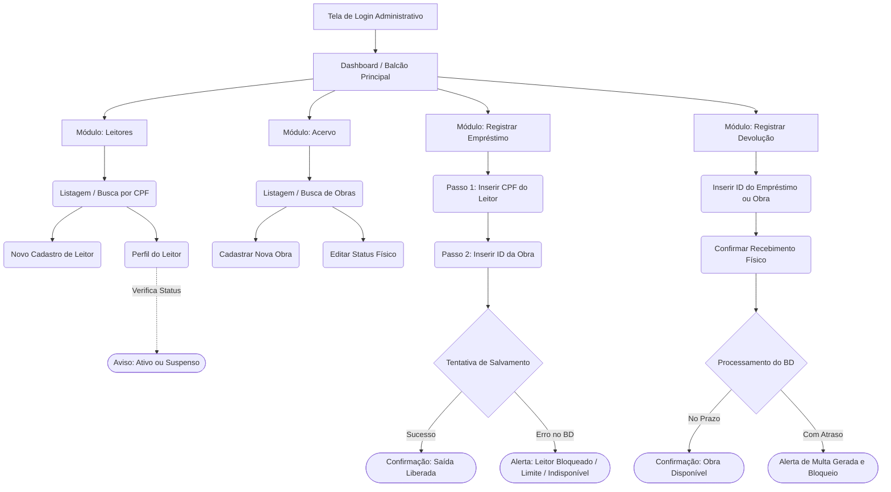
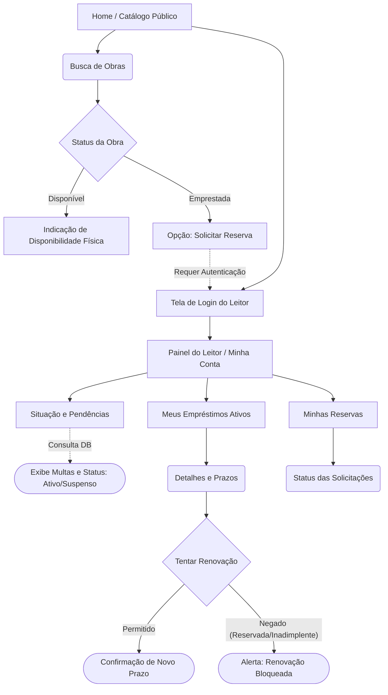

# API Contract Documentation: Biblioteca Municipal

## 1. Overview

Esta documentação define os contratos de comunicação (RESTful) entre o frontend (Vanilla JS) e o backend (Spring Boot).

A arquitetura é propositalmente enxuta, consumindo e enviando requisições assíncronas no formato `application/json`.

As validações complexas de negócio, como limites de empréstimo e cálculos de multa, são processadas pelo banco de dados (PostgreSQL), refletindo os erros no frontend por meio de respostas HTTP padronizadas.

**Base URL:** `/api/v1`

---

## 2. Fluxos de Navegação e Operação

## 2.1 Diagrama Mermaid do Fluxo de Operação do Balcão

## 2.2 Diagrama Mermaid do Fluxo de Operação do Balcão


## 3. Endpoints Administrativos (Bibliotecário)

### 3.1. Gerenciamento de Leitores (Readers)

#### `POST /readers`

Cadastra um novo leitor no sistema.

**Request Body**

```json
{
  "name": "João da Silva",
  "cpf": "12345678900",
  "email": "joao@email.com"
}
```

**Success Response (`201 Created`)**

```json
{
  "id": "a1b2c3d4-e5f6-7890-1234-56789abcdef0",
  "status": "ACTIVE"
}
```

---

#### `GET /readers/{cpf}`

Retorna os dados do leitor, incluindo seu status (`ACTIVE` ou `SUSPENDED`) e um resumo de seus empréstimos ativos. Utilizado para consultar o perfil antes da realização de um empréstimo.

**Success Response (`200 OK`)**

```json
{
  "id": "a1b2c3d4-e5f6-7890-1234-56789abcdef0",
  "name": "João da Silva",
  "cpf": "12345678900",
  "status": "ACTIVE",
  "activeLoansCount": 1
}
```

---

### 3.2. Operações de Balcão (Loans)

#### `POST /loans`

Registra a saída de uma obra.

O backend encaminha a solicitação ao banco de dados e repassa eventuais bloqueios gerados pelas regras de negócio implementadas por *Triggers* (por exemplo: limite de empréstimos excedido ou usuário suspenso).

**Request Body**

```json
{
  "readerId": "a1b2c3d4-e5f6-7890-1234-56789abcdef0",
  "itemId": "f0e9d8c7-b6a5-4321-0987-654321fedcba"
}
```

**Success Response (`201 Created`)**

```json
{
  "loanId": "98765432-1234-5678-abcd-ef0123456789",
  "dueDate": "2026-07-14",
  "status": "SUCCESS"
}
```

---

#### `PUT /loans/{id}/return`

Registra a devolução física da obra.

O Spring Boot preenche automaticamente o campo `returnDate` com a data atual, enquanto o PostgreSQL calcula e registra eventuais multas por atraso.

**Request Body**

Nenhum. A ação é inferida pela URL.

**Success Response (`200 OK`)**

```json
{
  "loanId": "98765432-1234-5678-abcd-ef0123456789",
  "returnDate": "2026-06-30",
  "fineGenerated": true,
  "fineAmount": 15.00,
  "readerStatus": "SUSPENDED"
}
```

---

# 4. Endpoints Públicos e Autoatendimento (Portal do Leitor)

## 4.1. Catálogo de Obras (Items)

### `GET /items?query={text}&type={type}`

Busca obras no acervo para consulta de disponibilidade.

O parâmetro `type` pode filtrar por:

- `BOOK`
- `MAGAZINE`
- `MEDIA`

**Success Response (`200 OK`)**

```json
[
  {
    "id": "f0e9d8c7-b6a5-4321-0987-654321fedcba",
    "title": "Clean Code",
    "author": "Robert C. Martin",
    "type": "BOOK",
    "status": "AVAILABLE"
  }
]
```

---

## 4.2. Ações do Leitor

### `PUT /loans/{id}/renew`

Solicita a renovação do prazo de um empréstimo vigente.

**Request Body**

Nenhum.

**Success Response (`200 OK`)**

```json
{
  "loanId": "98765432-1234-5678-abcd-ef0123456789",
  "newDueDate": "2026-07-28",
  "status": "RENEWED"
}
```

---

# 5. Padrão de Tratamento de Erros (Error Handling)

Quando uma restrição de negócio implementada no banco de dados impedir a transação, como:

- limite de empréstimos atingido;
- leitor suspenso;
- item indisponível;

o Spring Boot captura a exceção e retorna uma resposta HTTP padronizada, normalmente **400 Bad Request** ou **409 Conflict**. O frontend (Fetch API) utiliza essa resposta para exibir uma mensagem apropriada ao usuário.

## Error Response Format (`400 Bad Request` / `409 Conflict`)

```json
{
  "timestamp": "2026-06-30T14:30:00Z",
  "status": 409,
  "error": "Conflict",
  "message": "Loan rejected: Reader has reached the limit of 3 active loans.",
  "path": "/api/v1/loans"
}
```